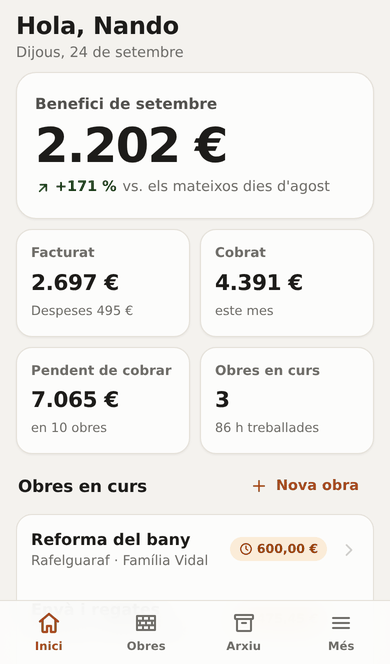
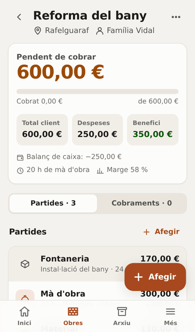
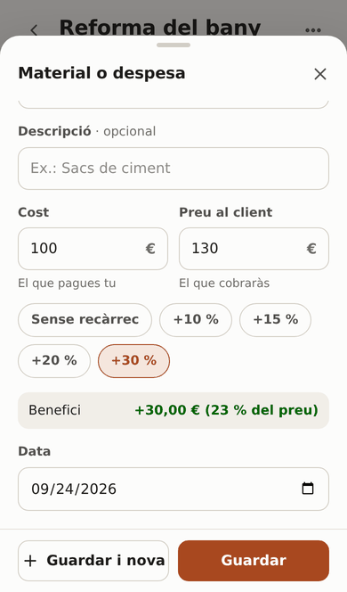
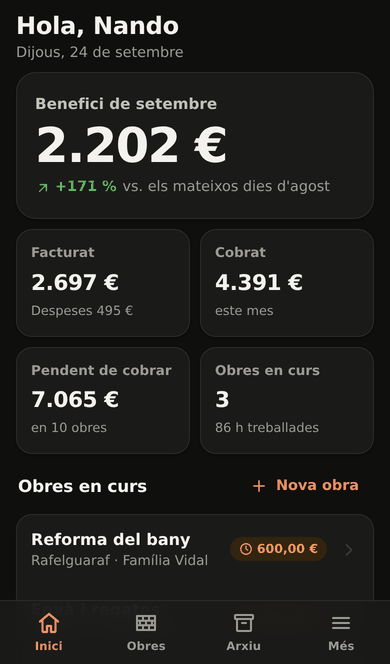
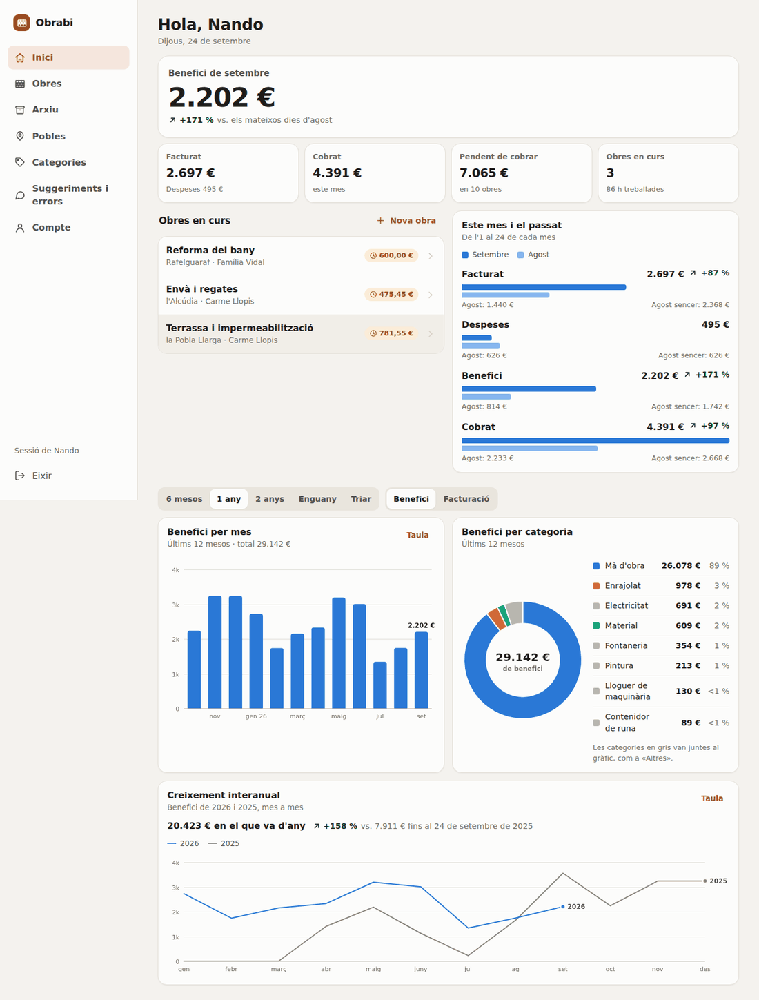
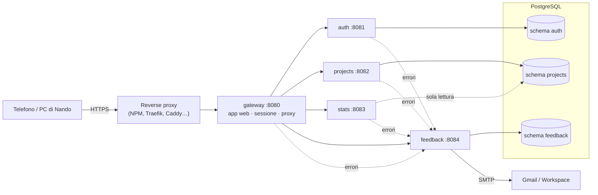
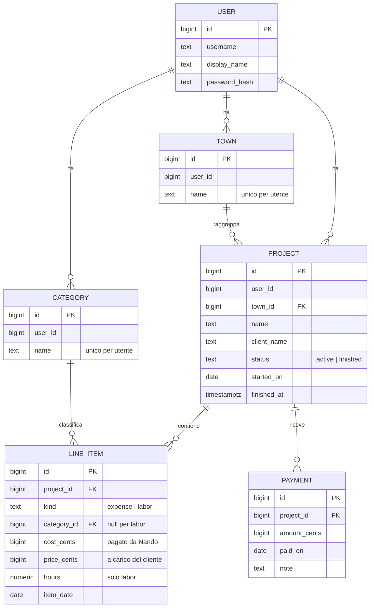

# Obrabi

**Els comptes de les teues obres.** Obrabi è una piccola BI per Nando, muratore
con lavori di ristrutturazione nella zona di València: per ogni obra tiene
traccia di quanto ha speso, quanto fattura al cliente, quanto il cliente ha già
pagato e del beneficio, e in home mostra le statistiche del mese.

- Interfaccia in **valenciano**, pensata prima per il **telefono** (si installa
  come app sulla schermata home) e poi per il PC.
- **Microservizi in Go** (Gin) con **PostgreSQL**, uno schema e un ruolo DB per
  servizio.
- Deploy con **Docker Compose**, pensato per un LXC o una VM su **Proxmox**
  on‑premise, con backup notturni.

| Inici | Obra | Nova partida | Mode fosc |
|---|---|---|---|
|  |  |  |  |

<details>
<summary>Versione desktop</summary>


</details>

---

## Indice

1. [Cosa fa](#cosa-fa)
2. [Architettura](#architettura)
3. [Modello dati](#modello-dati)
4. [Deploy su Proxmox](#deploy-su-proxmox)
5. [Email di segnalazioni e bug](#email-di-segnalazioni-e-bug)
6. [Backup e ripristino](#backup-e-ripristino)
7. [Amministrazione](#amministrazione)
8. [Sviluppo](#sviluppo)
9. [Scelte e assunzioni](#scelte-e-assunzioni)

---

## Cosa fa

**Inici (home)**
- Beneficio del mese in grande, con la variazione rispetto agli stessi giorni
  del mese scorso; poi fatturato, incassato, pendente da incassare, obres in
  corso e ore lavorate.
- Accesso rapido alle obres in corso.
- «Este mes i el passat»: confronto con il mese scorso (fatturato, spese,
  beneficio, incassato).
- Grafico **mensile** del beneficio o della fatturazione con intervallo
  configurabile (6 mesi, 1 anno, 2 anni, anno in corso, da‑a).
- **Torta per categoria** di spesa (beneficio o fatturazione), con tabella.
- **Crescita anno su anno**: linea dell'anno corrente contro il precedente,
  mese per mese, e totale da inizio anno confrontato con lo stesso periodo.
- Ogni grafico ha tooltip (tap o hover) e la vista tabella; i colori sono una
  palette validata anche per daltonici.

**Obres**
- Elenco raggruppato per **poble**, ricerca istantanea (senza accenti: `xativa`
  trova `Xàtiva`) per nome, poble o cliente, filtro «amb pendent de cobrar»,
  obres aperte di recente in cima.
- Scheda dell'obra: **pendente da incassare** in grande (o «Tot cobrat» con il
  beneficio), barra dell'incassato, totale cliente, spese, beneficio, bilancio
  di cassa (incassato − speso), ore di manodopera e margine.
- Inserimento rapido da un unico pulsante «Afegir»:
  - **Material o despesa**: categoria (chip delle più usate, ricerca, e se non
    esiste si crea), costo, prezzo al cliente con chip di ricarico
    (+10/15/20/30 %) e beneficio calcolato al volo;
  - **Mà d'obra**: ore × prezzo/ora = totale (modificabile), costo opzionale di
    un aiutante;
  - **Cobrament**: importo con il pulsante «Tot el pendent», data e nota
    (Bizum, efectiu…).
  - «Guardar i nova» per inserire più partide di fila; l'app ricorda l'ultima
    categoria, l'ultimo ricarico e l'ultima tariffa oraria.
- **Finalitzar** sposta l'obra nell'**Arxiu** (se resta qualcosa da incassare
  lo segnala e continua a contarlo come pendente). Si può riaprire.
- **PDF**: completo (con costi e margini, per Nando) o **per il cliente** (solo
  prezzi, pagamenti e pendente: mai costi o margini). Dal telefono si può
  condividere direttamente (WhatsApp, email…).

**Altro**
- Pobles e categorie: rinomina, elimina, e **unione** di categorie doppie
  («Fontaneria» e «Fontanería») perché le statistiche tornino.
- **Suggeriments i errors**: Nando scrive e Luca riceve un'email. Gli errori
  (del browser e dei servizi) vengono inviati automaticamente come bug di
  telemetria, deduplicati per non riempire la casella.
- Account: nome, cambio password, istruzioni per installare l'app.
- PWA: icona sulla home del telefono, avvio a schermo intero, funziona anche
  con copertura scarsa per l'apertura (i dati richiedono connessione).

---

## Architettura



| Servizio | Responsabilità | Dati |
|---|---|---|
| `gateway` | Unico servizio esposto. Serve la SPA (incorporata nel binario), login/logout, cookie di sessione (JWT firmato solo qui), inoltra `/api/*` ai servizi aggiungendo l'identità verificata. | – |
| `auth` | Utenti e credenziali (bcrypt). Crea `nando` con password casuale al primo avvio. CLI di amministrazione. | schema `auth` |
| `projects` | Pobles, obres, partides, categorie, cobraments, archivio, PDF. | schema `projects` |
| `stats` | Statistiche della home. Lato lettura: ruolo DB con solo `SELECT` sullo schema `projects`. | – |
| `feedback` | Suggerimenti, bug, telemetria errori (deduplicata) e invio email con coda e tentativi. | schema `feedback` |

Dettagli:
- Monorepo Go (un `go.mod`), un binario per servizio in `cmd/`, codice
  condiviso in `internal/platform`. Una sola immagine Docker, cinque container.
- Ogni servizio ha il suo **ruolo PostgreSQL**: `auth` non vede le obres,
  `feedback` non vede gli utenti, `stats` può solo leggere. Le migrazioni SQL
  sono incorporate e girano all'avvio di ciascun servizio.
- I servizi interni accettano solo richieste con il token interno condiviso e
  ricevono l'utente dal gateway (`X-User-ID`), che scarta qualsiasi valore
  arrivato da fuori.
- Reti Docker: il DB e i servizi stanno su una rete **senza accesso a
  Internet**; solo il gateway è pubblicato e solo `feedback` può uscire (SMTP).
- Frontend senza framework né build: moduli ES nativi, CSS con token chiaro /
  scuro, grafici SVG scritti a mano, CSP rigorosa.

---

## Modello dati

L'ER di partenza era giusto nella sostanza; qualche precisazione sulle
cardinalità:

- **obra → poble è N:1**, non 1:1: ogni obra sta in un poble, un poble ha molte obres.
- **partida → categoria è N:1**: molte voci di spesa condividono la stessa categoria.
- La **mà d'obra** è una partida speciale (`kind = labor`) con ore e prezzo e
  senza categoria; nelle statistiche compare come «Mà d'obra».
- I **cobraments** (pagamenti del cliente) sono un'entità a sé, 1:N con l'obra:
  scalano il totale da pagare.
- Pobles e categorie appartengono all'utente, come le obres.



Gli utenti vivono nello schema `auth`, il resto nello schema `projects`: tra
schemi diversi non ci sono foreign key (ogni servizio possiede i suoi dati).
Gli importi sono sempre **centesimi interi**.

**Formule di un'obra**

| Valore | Formula |
|---|---|
| Totale cliente | Σ prezzo delle partide |
| Spese (pagato da Nando) | Σ costo delle partide |
| Beneficio | totale cliente − spese |
| Incassato | Σ cobraments |
| Pendente da incassare | totale cliente − incassato |
| Bilancio di cassa | incassato − spese |

**L'esempio di Rafelguaraf**: materiale pagato 100 e rivenduto 130, fontaneria
150 → 170, manodopera 300 (20 h). Spese 250, totale cliente **600**, beneficio
**350** (30 + 20 + 300); finché il cliente non paga, il pendente è 600 e il
bilancio di cassa −250. Nel testo della richiesta il pendente era 620, ma
130 + 170 + 300 fa 600: se c'era un'altra voce, basta aggiungerla come partida.
L'esempio è coperto da un test (`internal/projects/totals_test.go`) ed è tra i
dati demo.

---

## Deploy su Proxmox

Obrabi è leggero: **1–2 vCPU, 1 GB di RAM e 8 GB di disco** bastano.

### 1. LXC (o VM) con Docker

Un container **LXC Debian 12 non privilegiato** con `nesting` e `keyctl`
attivi (servono a Docker). Dalla shell del nodo Proxmox, adattando VMID,
storage, template e rete:

```sh
pct create 120 local:vztmpl/debian-12-standard_12.7-1_amd64.tar.zst \
  --hostname obrabi --cores 2 --memory 2048 --swap 512 \
  --rootfs local-lvm:8 --net0 name=eth0,bridge=vmbr0,ip=dhcp \
  --unprivileged 1 --features nesting=1,keyctl=1 --onboot 1
pct start 120
pct enter 120
```

(Dalla GUI: *Create CT* → spunta *Unprivileged* → in *Options → Features*
attiva *nesting* e *keyctl*.) In alternativa una **VM Debian 12** funziona
allo stesso modo.

Dentro il container:

```sh
apt update && apt install -y ca-certificates curl git make
curl -fsSL https://get.docker.com | sh
```

### 2. Installazione

```sh
git clone https://github.com/lucabodd/obrabi.git /opt/obrabi
cd /opt/obrabi
./scripts/gen-env.sh        # crea .env con tutti i segreti casuali
nano .env                   # SMTP_USERNAME e SMTP_PASSWORD (vedi sotto)
docker compose up -d --build
docker compose ps           # tutti "healthy" dopo ~30 s
make password               # password iniziale di nando
```

Al primo avvio il servizio `auth` crea l'utente **nando** con una password
casuale del tipo `k7mw-3xqp-9hte-rv4d` e la stampa **una sola volta** nei log
(`make password` la ritrova). Dopo il primo accesso Nando può cambiarla da
*Compte*. Persa? `make reset-password WHO=nando` ne genera una nuova.

L'app risponde su `http://IP-DEL-CONTAINER:8080` (utile per una prova in LAN).

### 3. Esposizione su Internet (HTTPS)

Nando la usa dal cantiere, quindi deve essere raggiungibile da fuori e in
**HTTPS** (necessario anche per installarla come app). Tre strade:

**a) Reverse proxy che hai già** (Nginx Proxy Manager, Traefik, Caddy su un
altro LXC): crea un host per il tuo dominio verso `http://IP-DEL-CONTAINER:8080`
con certificato Let's Encrypt, e in `.env` indica l'IP del proxy perché il
limite ai tentativi di login veda l'IP vero dei client:

```ini
OBRABI_TRUSTED_PROXIES=192.168.1.20
```

Poi `docker compose up -d`. Se il proxy è l'unica via d'accesso, puoi anche
mettere `OBRABI_BIND=127.0.0.1` o filtrare la porta 8080 dal firewall di Proxmox.

**b) Caddy incluso**: se il container riceve direttamente le porte 80 e 443
(port forwarding dal router), imposta il dominio e avvia il profilo `https`;
Caddy ottiene e rinnova il certificato da solo.

```ini
OBRABI_DOMAIN=obrabi.tuodominio.it
OBRABI_BIND=127.0.0.1
```
```sh
docker compose --profile https up -d
```

**c) Cloudflare Tunnel** (nessuna porta aperta sul router): punta il tunnel a
`http://IP-DEL-CONTAINER:8080` e aggiungi l'IP del connettore a
`OBRABI_TRUSTED_PROXIES`.

Il cookie di sessione è `Secure` automaticamente quando la richiesta arriva in
HTTPS (anche attraverso il proxy, via `X-Forwarded-Proto`); resta valido 60
giorni e si rinnova usando l'app, così Nando non deve rifare il login.

### 4. Aggiornamenti

```sh
cd /opt/obrabi
git pull
docker compose up -d --build
```

Le migrazioni del database girano da sole all'avvio dei servizi.

---

## Email di segnalazioni e bug

Ogni suggerimento, bug segnalato e **errore automatico** (nuovo) arriva per
email a `OBRABI_REPORT_EMAIL_TO` (predefinito `lucabodd@gmail.com`). Con Google
Workspace / Gmail:

1. Attiva la verifica in due passaggi sull'account che invia.
2. Crea una **password per le app**: <https://myaccount.google.com/apppasswords>.
3. In `.env`:
   ```ini
   SMTP_HOST=smtp.gmail.com
   SMTP_PORT=587
   SMTP_USERNAME=obrabi@tuodominio.it
   SMTP_PASSWORD=abcdefghijklmnop     # la password per le app, senza spazi
   SMTP_FROM=Obrabi <obrabi@tuodominio.it>   # facoltativo
   OBRABI_REPORT_EMAIL_TO=lucabodd@gmail.com
   ```
4. `docker compose up -d feedback` e prova da *Suggeriments i errors*.

Se nel Workspace le password per le app sono disattivate dall'amministratore,
si può usare il relay SMTP di Workspace (`smtp-relay.gmail.com`).

Come funziona: le segnalazioni vengono salvate nel DB e un worker invia le
email in background con tentativi a distanza crescente (1 min, 5 min, 30 min,
2 h, 6 h), quindi un'interruzione di rete non perde nulla. Gli errori
automatici con la stessa «impronta» nelle 6 ore successive incrementano solo un
contatore (niente valanghe di email). Senza SMTP configurato le segnalazioni
restano comunque salvate nella tabella `feedback.reports`. Il servizio rifiuta
di inviare credenziali senza STARTTLS.

---

## Backup e ripristino

Il servizio `backup` esegue un `pg_dump` completo **ogni 24 ore** in
`/opt/obrabi/backups` (formato custom, conservati 30 giorni; configurabile con
`BACKUP_INTERVAL_HOURS` e `BACKUP_KEEP_DAYS`). `make backup` ne fa uno subito.

Su Proxmox conviene comunque includere il container nei job di
**vzdump / Proxmox Backup Server**: la cartella `backups/` finisce così anche
fuori dal nodo.

Ripristino:

```sh
cd /opt/obrabi
docker compose stop gateway auth projects stats feedback
docker compose exec -T db pg_restore -U obrabi_admin -d obrabi --clean --if-exists \
  < backups/obrabi-AAAAMMGG-HHMMSS.dump
docker compose start auth projects stats feedback gateway
```

---

## Amministrazione

| Comando | Cosa fa |
|---|---|
| `make ps` / `make logs` | stato e log dei servizi |
| `make password` | password iniziale stampata al primo avvio |
| `make users` | elenco utenti |
| `make reset-password WHO=nando` | nuova password casuale |
| `docker compose exec auth /app/auth user add maria "Maria"` | nuovo utente (con dati propri e separati) |
| `make seed-demo USER_ID=2` | dati di esempio in un account **vuoto** |
| `make backup` | backup immediato |

Configurazione: tutte le variabili sono documentate in [`.env.example`](.env.example).

---

## Sviluppo

Requisiti: Go ≥ 1.26, Docker, Node (solo per i test del frontend).

```sh
./scripts/gen-env.sh
make dev          # PostgreSQL in Docker, i 5 servizi in locale su http://localhost:8080
make dev-seed     # (in un altro terminale) ~18 mesi di dati demo per nando
make test         # test Go + test del frontend
make lint
```

In sviluppo il cookie non è `Secure` perché si lavora in HTTP su localhost;
la password iniziale di nando compare nell'output di `make dev`.

Test d'integrazione su PostgreSQL reale (il nome del DB deve contenere "test",
lo schema `projects` viene ricreato):

```sh
createdb obrabi_test
OBRABI_TEST_DATABASE_URL=postgres://localhost/obrabi_test?sslmode=disable go test ./internal/integration/
```

Struttura:

```
cmd/<servizio>/          entrypoint (+ sottocomando healthcheck per Docker)
internal/platform/       config, database e migrazioni, middleware Gin, telemetria, log, importi
internal/<servizio>/     codice del servizio; migrazioni in internal/<servizio>/migrations
internal/integration/    test d'integrazione SQL
web/static/              frontend (ES modules, CSS, icone, service worker), incorporato nel gateway
web/tests/               test del frontend
deploy/                  init di PostgreSQL, backup, Caddy
scripts/                 gen-env.sh, dev.sh
```

Convenzioni (vedi anche [`CLAUDE.md`](CLAUDE.md)): codice e commenti in
inglese, interfaccia e messaggi d'errore dell'API in valenciano, email a Luca
in italiano; importi in centesimi interi; ogni query filtrata per utente;
migrazioni solo in aggiunta.

---

## Scelte e assunzioni

- **Quando conta un guadagno**: nelle statistiche il fatturato, le spese e il
  beneficio di una partida contano nel mese della sua **data** (di default
  oggi, modificabile); l'incassato nel mese del pagamento.
- **Confronto con il mese scorso**: si confrontano gli stessi giorni (1–24
  settembre con 1–24 agosto), così a inizio mese il confronto è equo; il mese
  scorso intero è indicato a parte. La crescita anno su anno usa la stessa
  logica sul totale da inizio anno.
- **Manodopera**: il beneficio è tutto il prezzo, salvo un costo opzionale se
  Nando paga un aiutante.
- **Finalizzare non richiede il saldo**: un'obra finita ma non pagata del tutto
  va in archivio e resta nel «pendente da incassare» della home.
- **Colori della torta**: le tre categorie con più fatturato di sempre hanno un
  colore fisso, le altre sono «Altres»; così il colore segue la categoria e
  non cambia filtrando.
- **Un'unica lingua**: i testi sono direttamente in valenciano (norma AVL,
  forme valenciane: *este*, *eixir*, *tindre*, *hui*…), senza sistema di
  traduzioni.
